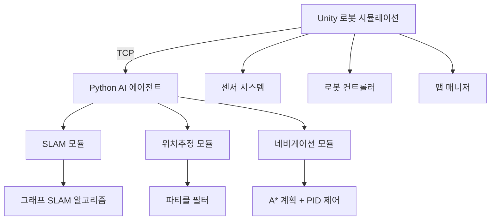

# 🤖 로봇공학 SLAM & 네비게이션 프로젝트

[](https://unity.com/)
[](https://www.python.org/)
> Unity와 Python을 활용한 SLAM, 위치추정, 경로계획 알고리즘 구현 프로젝트

## 🌟 주요 기능

- **🗺️ 그래프 SLAM**: 랜드마크 기반 동시 위치추정 및 지도작성
- **📍 파티클 필터 위치추정**: 파티클 필터를 이용한 로봇 위치 추정
- **🛣️ 경로 계획**: A* 알고리즘과 경로 스무딩
- **🎮 PID 네비게이션**: 정밀한 로봇 제어 및 경로 추종
- **🔄 실시간 통신**: Unity-Python TCP 통신
- **📊 인터랙티브 시각화**: 실시간 플롯 및 디버깅 도구

## 🎥 데모

<div align="center">

| SLAM 시각화 | 파티클 필터 | 경로 계획 |
|:--:|:--:|:--:|
|  |  |  |

</div>

## 🏗️ 시스템 구조



## 🚀 빠른 시작

### 필수 조건

- **Unity**: 2022.3 LTS 이상
- **Python**: 3.8+
- **운영체제**: Windows 10/11, macOS, 또는 Linux

### 설치

1. **저장소 클론**
   ```bash
   git clone https://github.com/yourusername/robotics-slam-navigation.git
   cd robotics-slam-navigation
   ```

2. **Python 종속성 설치**
   ```bash
   pip install -r requirements.txt
   ```

3. **Unity 프로젝트 열기**
   - Unity Hub 실행
   - 클론한 디렉토리에서 프로젝트 추가
   - Package Manager를 통해 Newtonsoft Json 패키지 설치

### 프로젝트 실행

#### 🗺️ 문제 1: SLAM
```bash
# 터미널 1: Python SLAM 시작
cd SLAM/
python SLAMmain.py

# Unity: OperationMode를 SLAM으로 설정하고 Play 버튼 클릭
```

#### 📍 문제 2: 위치추정
```bash
# 터미널 1: Python 위치추정 시작
cd Localization_visual/
python LandmarkLocalization.py

# Unity: OperationMode를 Landmark로 설정하고 Play 버튼 클릭
```

#### 🛣️ 문제 3: 경로계획 & 네비게이션
```bash
# 터미널 1: Python 네비게이션 시작
cd Plan_Navi_/
python navigation_main.py

# Unity: OperationMode를 Landmark로, Port를 5002로 설정하고 Play 버튼 클릭
```

#### 🎯 문제 4-5: 고급 기능
```bash
# 터미널 1: 고급 네비게이션 시작
cd Result/
python navigation_main.py

# Unity: OperationMode를 RangeFinder로, Port를 5002로 설정하고 Play 버튼 클릭
```

## 📁 프로젝트 구조

```
robotics-slam-navigation/
├── 📂 SLAM/                          # 문제 1: 그래프 SLAM 구현
│   ├── SLAMmain.py                   # SLAM 메인 실행 파일
│   ├── graph_slam.py                 # 그래프 SLAM 알고리즘
│   └── UnityInterface.py             # Unity 통신 인터페이스
│
├── 📂 Localization_visual/           # 문제 2: 파티클 필터 위치추정
│   ├── LandmarkLocalization.py       # 위치추정 메인 실행 파일
│   ├── LandmarkParticleFilter.py     # 파티클 필터 구현
│   ├── UnityInterfaceFor23.py        # 문제 2-3용 Unity 인터페이스
│   └── particle_filter_visualizer.py # 실시간 시각화
│
├── 📂 Plan_Navi_/                   # 문제 3: 경로계획 & 네비게이션
│   ├── navigation_main.py            # 네비게이션 메인 실행 파일
│   ├── smoothNavigator.py            # A* + 스무딩 + PID 제어
│   ├── BaseLocalization.py           # 기본 위치추정 클래스
│   └── UnityInterfaceFor3.py         # 문제 3용 Unity 인터페이스
│
├── 📂 Result/                       # 문제 4-5: 고급 기능
│   ├── navigation_main.py            # 장애물 회피 포함 네비게이션
│   ├── smoothNavigator.py            # 개선된 스무딩 알고리즘
│   ├── BaseLocalization.py           # 향상된 위치추정
│   └── UnityInterfaceFor3.py         # 고급 Unity 인터페이스
│
├── 📂 Unity_C3_Script/              # Unity C# 스크립트
│   ├── RobotController.cs            # 로봇 움직임 제어
│   ├── SensorSystem.cs              # 센서 데이터 수집
│   ├── RobotDataTransmitter.cs      # TCP 데이터 전송
│   ├── MapManager.cs                # 맵 및 장애물 관리
│   └── GridManager.cs               # 격자 시각화
│
├── 📂 docs/                         # 문서 및 이미지
├── requirements.txt                  # Python 종속성
└── README.md                        # 이 파일
```

## ⚙️ 설정

### 로봇 파라미터

| 파라미터 | 값 | 설명 |
|----------|-------|-------------|
| 맵 크기 | 25 × 15 | 격자 차원 |
| 셀 크기 | 1m × 1m | 격자 해상도 |
| 초기 위치 | (22.5, 11.5, 1.5π) | SLAM용 시작 포즈 |
| 스텝 거리 | 0.5m | 스텝당 이동거리 |
| 조향각 | 2π/50 rad | 스텝당 회전각 |

### 알고리즘 파라미터

#### SLAM 설정
```python
MOTION_NOISE = 1.0      # 로봇 움직임 노이즈
MEASUREMENT_NOISE = 4.0  # 센서 측정 노이즈
```

#### 파티클 필터 설정
```python
NUM_PARTICLES = 1000     # 파티클 개수
MOTION_NOISE = 0.1      # 모션 모델 노이즈
MEASUREMENT_NOISE = 0.4  # 센서 노이즈
```

#### PID 제어 설정
```python
Kp = 0.3  # 비례 게인
Ki = 0.05 # 적분 게인  
Kd = 0.4  # 미분 게인
```

## 📊 실험 결과

### 성능 분석

| 테스트 시나리오 | 수렴 시간 | 정확도 | 비고 |
|----------------|----------|-------|-------|
| 노이즈 없음 | ~3초 | 99.8% | 완벽한 조건 |
| 하드웨어 노이즈만 | ~3초 | 59% | 노이즈로 인한 41% 오차 |
| 랜드마크 4개 | ~3초 | 95% | 최적의 랜드마크 개수 |
| 랜드마크 2개 | ~5.5초 | 85% | 랜드마크 밀도 감소 |

### 노이즈 영향 분석

<div align="center">

| 시나리오 | SLAM 성능 | 위치추정 정확도 |
|:--------:|:----------:|:---------------:|
| 노이즈 없음 |  |  |
| 노이즈 있음 |  |  |

</div>

## 🔧 문제 해결

<details>
<summary><b>연결 문제</b></summary>

**문제**: Unity-Python 연결 실패
```bash
# 포트 사용 가능 여부 확인
netstat -an | grep 5000

# 대체 포트 시도
python SLAMmain.py --port 5001
```

**문제**: TCP 타임아웃 오류
- 지정된 포트에서 방화벽이 연결을 허용하는지 확인
- Unity와 Python이 같은 기기에서 실행 중인지 확인
- 연결 설정에서 IP 주소 확인

</details>

<details>
<summary><b>성능 문제</b></summary>

**문제**: 파티클 필터 수렴 속도 느림
```python
# 빠른 처리를 위해 파티클 수 감소
NUM_PARTICLES = 500

# 리샘플링 임계값 증가
RESAMPLE_THRESHOLD = 0.3
```

**문제**: PID 진동
```python
# 진동 감소를 위해 미분 게인 증가
Kd = 0.6

# 비례 게인 감소
Kp = 0.2
```

</details>

<details>
<summary><b>시각화 문제</b></summary>

**문제**: Matplotlib 플롯이 업데이트되지 않음
```python
import matplotlib.pyplot as plt
plt.ion()  # 대화형 모드 활성화
plt.show(block=False)
```

**문제**: Unity 디버그 라인이 보이지 않음
- SensorSystem에서 `showDebugLines` 활성화
- Scene 뷰 카메라 위치 확인
- 라인 렌더러 머티리얼 확인

</details>

## 🧪 테스트

설치 확인을 위한 테스트 실행:

```bash
# Python 컴포넌트 테스트
python -m pytest tests/

# Unity-Python 통신 테스트
python test_communication.py
```

## 🤝 기여하기

기여를 환영합니다! 다음 단계를 따라주세요:

1. 저장소를 포크합니다
2. 기능 브랜치를 생성합니다 (`git checkout -b feature/amazing-feature`)
3. 변경사항을 커밋합니다 (`git commit -m 'Add some amazing feature'`)
4. 브랜치에 푸시합니다 (`git push origin feature/amazing-feature`)
5. Pull Request를 엽니다

### 개발 가이드라인

- Python 코드는 PEP 8을 따라주세요
- 의미있는 변수명을 사용해주세요
- 복잡한 알고리즘에는 주석을 추가해주세요
- 새 기능에는 단위 테스트를 포함해주세요

## 📚 문서

- [알고리즘 상세](docs/algorithms.md)
- [API 참조](docs/api.md)
- [Unity 설정 가이드](docs/unity-setup.md)
- [성능 튜닝](docs/performance.md)

## 🎓 교육 자료

- [확률적 로봇공학](http://www.probabilisticrobotics.org/) - Sebastian Thrun
- [계획 알고리즘](http://planning.cs.uiuc.edu/) - Steven LaValle
- [ROS 네비게이션 스택](http://wiki.ros.org/navigation)
- [Unity 로보틱스 허브](https://github.com/Unity-Technologies/Unity-Robotics-Hub)

## 📄 라이선스

이 프로젝트는 MIT 라이선스에 따라 라이선스가 부여됩니다. 자세한 내용은 [LICENSE](LICENSE) 파일을 참조하세요.

## 🏆 감사의 말

- **작성자**: 조남웅 (컴퓨터공학과, 학번: 32224332)
- **지도교수**: 최용근 교수님
- **과목**: 로봇공학개론
- **제출일**: 2024년 12월 13일

## 📞 지원

질문이나 문제가 있으시면:

- 📧 이메일: [your.email@university.edu]
- 💬 토론: [GitHub Discussions](https://github.com/yourusername/robotics-slam-navigation/discussions)
- 🐛 버그 신고: [GitHub Issues](https://github.com/yourusername/robotics-slam-navigation/issues)

---

<div align="center">

**⭐ 이 저장소가 도움이 되었다면 스타를 눌러주세요!**

[🔝 맨 위로](#-로봇공학-slam--네비게이션-프로젝트)

</div>
